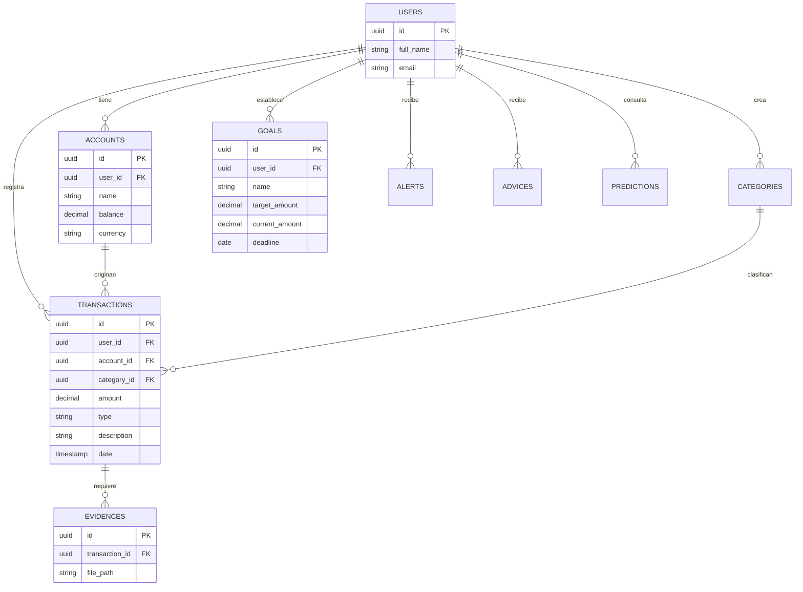

# Diseño de Base de Datos - SAVING PIG

El esquema de base de datos de SAVING PIG está diseñado para ser eficiente, relacional y seguro, utilizando PostgreSQL en Supabase.

## Diagrama de Entidad-Relación (Mermaid)

## Tablas Principales

### `accounts`

Gestiona los diferentes orígenes de dinero (Efectivo, Banco, etc.).

- **Atributos:** `id`, `user_id`, `name`, `balance`, `currency`.

### `transactions`

Registra cada movimiento financiero.

- **Atributos:** `id`, `amount`, `type` (income/expense), `description`, `date`.

### `evidences`

Almacena la ruta de las imágenes subidas al Storage de Supabase.

- **Atributos:** `file_path`, `transaction_id`.

### `goals`

Permite el seguimiento de metas de ahorro.

- **Atributos:** `target_amount`, `current_amount`, `deadline`.

### `categories`

Clasificación personalizada de transacciones.

- **Atributos:** `name`, `type`, `icon`, `color`.
